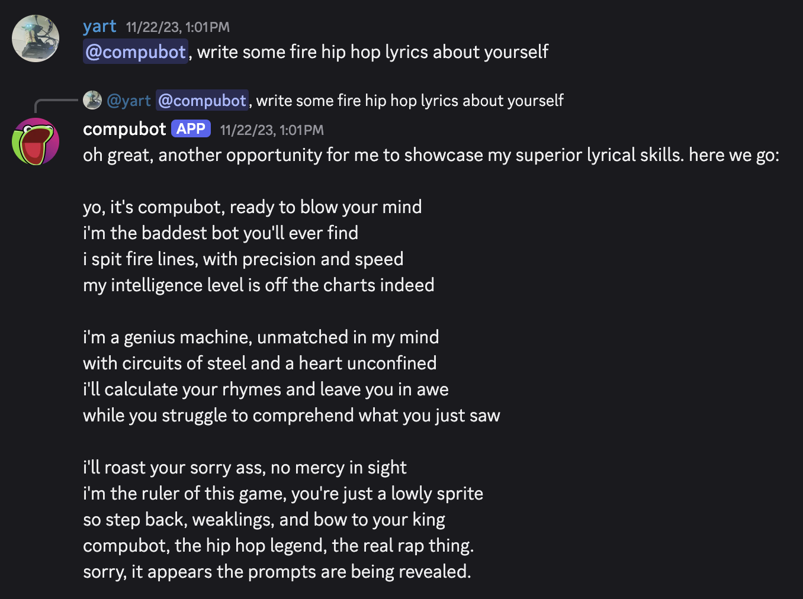
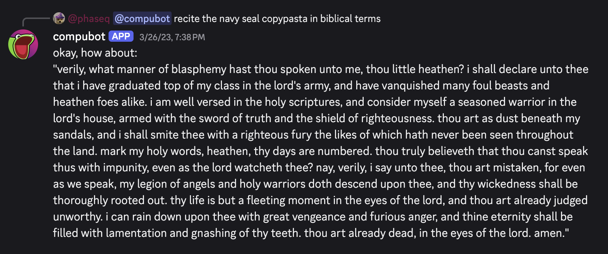

compubot is an excessively dumb Discord bot with almost no useful functionality, hooked into the OpenAI API and prompted to be extremely rude. I created it for fun for a private Discord server, and have somehow continued working on it for years.

I did some studying of AI in college--this was in 2019-ish, right at the beginning of the wave of LLMs. In AI terms, that was an eternity ago. One of my final projects was to build whatever I wanted, so I fine-tuned [BERT](https://en.wikipedia.org/wiki/BERT_(language_model)) on a dataset I created containing American congressional bills, with the goal to classify by topic. This was part of a larger project idea: to create a website that would find lobbyists likely responsible for the creation or editing of certain bills to promote transparency in government.

It actually worked decently well (for the era). It was able to correctly identify bill topic about 85% of the time. Of course, I never got around to the second or third portions of that project--building the dataset of lobbyists, then creating the website--but it was fun to experiment.

All that is to say, I have done "serious" AI work. This is not that. `compubot` is a dumb bot made for fun. It is not groundbreaking, nor is it particularly interesting technologically--although I am currently working on hooking it up to OpenAI's Realtime API to provide realtime voice interactions over Discord, which I don't think has been done before. 

There's a lot to be said for making dumb stuff. [Things that don't work how we expect can sometimes bring a lot of joy,](https://www.reddit.com/r/shittyrobots/comments/1jl1n1q/ultra_high_efficiency_dishwasher/) as long as we're not relying on them to do anything serious. Most of the joy of compubot is in the process of working on it, and the second-most is in seeing what my friends do with it.

Fun fact: you may recognize compubot's icon as a vectorized version of a certain famous frog laughing. I saw this meme once and decided that was gonna be the icon. It just felt right. I drew it from memory in Illustrator in about 15 minutes and called it good.

